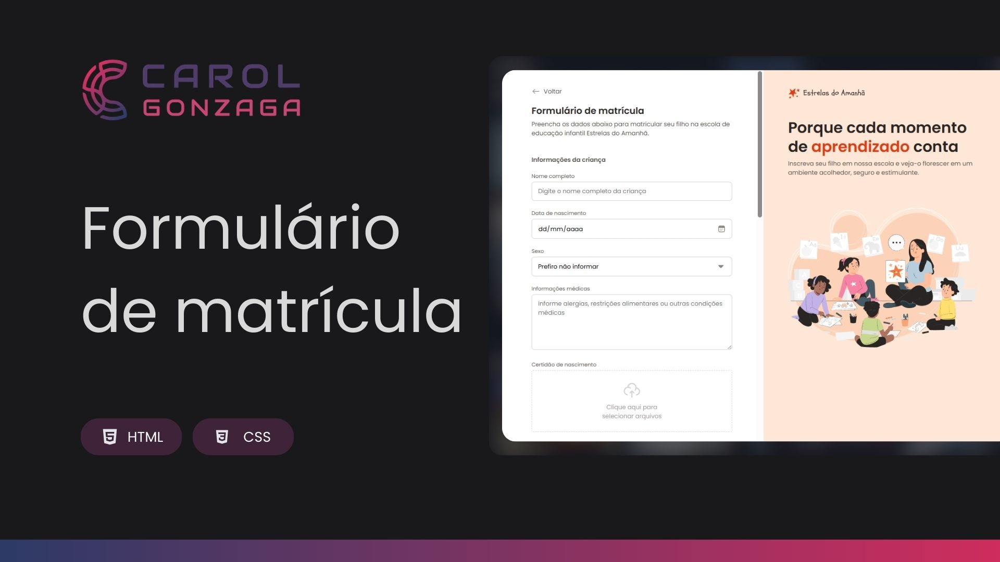

  

 

Um projeto que apresenta um formulário intuitivo para o cadastro de alunos, com foco na usabilidade e em um design limpo.

  <a href="#-tecnologias">Tecnologia</a>&nbsp;&nbsp;&nbsp;|&nbsp;&nbsp;&nbsp;<a href="https://carolgonzaga.github.io/formulario-de-matricula/">Acesse o Projeto</a>

 
 

  

 
 

## 🚀 Tecnologias

Esse projeto foi desenvolvido com as seguintes tecnologias:

- HTML5
- CSS3

 
 

## 🎯 Objetivo

O intuito deste projeto é treinar os conceitos sobre formulários aprendidos em aula, através da criação de um formulário de matrícula simples e eficiente. A interface foi desenvolvida para oferecer uma experiência agradável e intuitiva, facilitando a coleta das informações essenciais e demonstrando a aplicação prática usando HTML e CSS.
